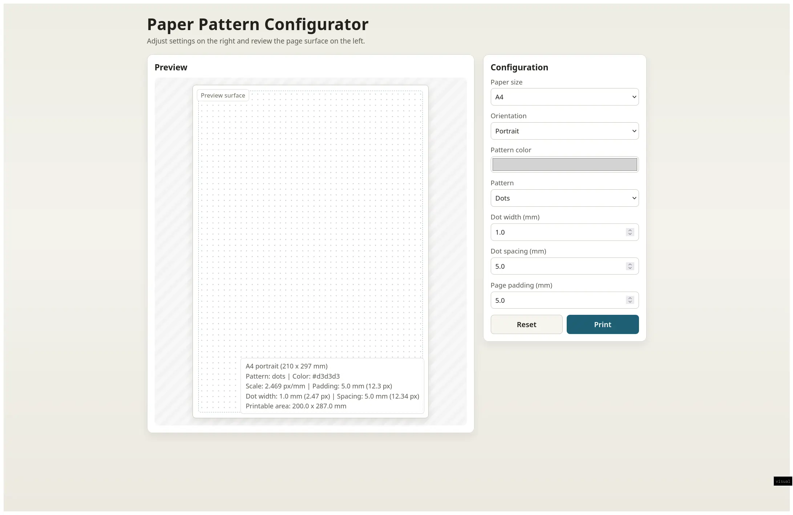

# Paper Toolkit

<p align="center">
  
</p>

Paper Toolkit is an Astro + React app for generating printable paper pattern PDFs.
It provides a live preview and in-browser PDF generation so the rendered pattern
matches physical dimensions when printed.

<p align="center">
  <a href="https://vibescale.github.io/#6">
    
  </a>
</p>

## Features

- Live paper preview with responsive layout (desktop split view, stacked on mobile)
- Configurable paper settings:
  - Paper size (`A4`, `A3`)
  - Orientation (`portrait`, `landscape`)
  - Pattern color
  - Dot width (mm)
  - Dot spacing (mm)
  - Page padding (mm)
- Client-side PDF generation with millimeter units for print fidelity
- Print flow with popup/print fallback to direct PDF download
- Reducer-driven form and preview synchronization

## Tech Stack

- Astro 5
- React 19 (Astro island)
- TypeScript (strict config)
- jsPDF for PDF creation
- Bun for package management and scripts

## Getting Started

Run all commands from the repository root.

```bash
bun install
bun run dev
```

Then open `http://localhost:4321`.

## Scripts

```bash
bun run dev      # Start dev server
bun run build    # Build production output to dist/
bun run preview  # Preview production build locally
bun run astro    # Run Astro CLI commands
```

Primary verification command:

```bash
bun run build
```

## Project Structure

```text
.
├── public/
├── src/
│   ├── components/
│   │   ├── PaperConfigurator.tsx
│   │   └── PaperConfigurator.css
│   └── pages/
│       └── index.astro
├── docs/
│   └── verification/
└── package.json
```

## Notes

- Main route: `src/pages/index.astro`
- Main interactive module: `src/components/PaperConfigurator.tsx`
- Generated build output: `dist/`
